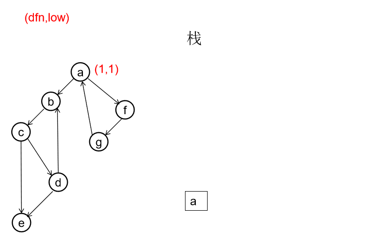

* 在有向图G中，如果任意两个不同的顶点 相互可达，则称该有向图是强连通的。   
* 有向图G的极大强连通子图称为G的强连通分支。  

> 做一遍DFS，用dfn[i]表示编号为i的节点在DFS过程中 的访问序号(也可以叫做开始时间）。在DFS过程中会形成 一搜索树。在搜索树上越先遍历到的节点，显然dfn的值就 越小。dfn值越小的节点，就称为越“早” 。 

> 用low[i]表示从i节点出发DFS过程中i下方节点(开始时间大 于dfn[i]，且由i可达的节点）所能到达的最早的节点的开始 时间。初始时low[i]=dfn[i] 

> DFS过程中，碰到哪个节点，就将哪个节点入栈。栈中节 点只有在其所属的强连通分量已经全部求出时，才会出栈。 

> 如果发现某节点u有边连到栈里的节点v，则更新u的low 值 为min(low[u],dfn[v]) ，若low[u]被更新为dfn[v],则表明目前 发现u可达的最早的节点是v. 

> 对于u的子节点v，从v出发进行的DFS结束回到u 时，使得 low[u] = min(low[u],low[v])。因为u可达v, 所以v可达的最早的节点，也是u可达的。 
 
> 如果一个节点u，从其出发进行的DFS已经全部完 成并回到u，而且此时其low值等于dfn值，则说明 u可达的所有节点，都不能到达任何比u早的节点 --- 那么该节点u就是一个强连通分量在DFS搜索树 中的根。 
 
> 此时，显然栈中u上方的节点，都是不能到达比u 早的节点的。将栈中节点弹出，一直弹到u(包括u), 弹出的节点就构成了一个强连通分量. 

#### 有向图强连通分支的Tarjan算法 伪代码
```cpp
void Tarjan(u) {  
    dfn[u]=low[u]=++index
    stack.push(u)
    foreach (u, v) in E {
        if (v is not visted) {
            tarjan(v)
            low[u] = min(low[u], low[v])
        } else if (v in stack) {    
            low[u] = min(low[u], dfn[v])    
        }
    }  
    if (dfn[u] == low[u]) { //u是一个强连通分量的根   
        repeat 
            v = stack.pop
            print v
        until (u== v)   
    } //退栈，把整个强连通分量都弹出来 
} //复杂度是O(E+V)的 
```

#### 图片动作演示
