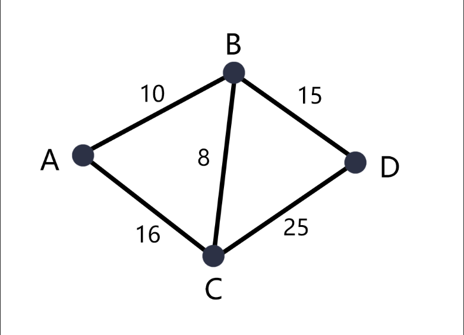
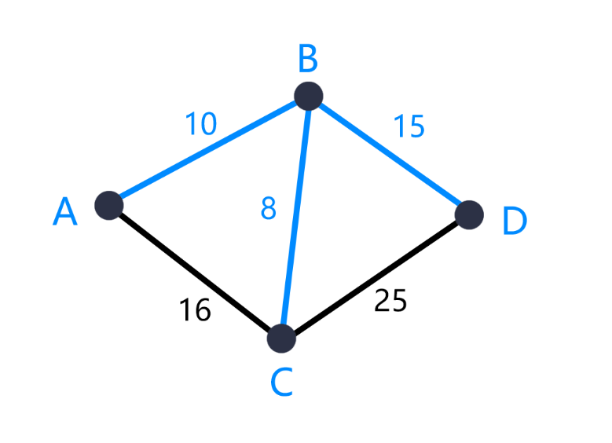

# 最小生成树算法
  
通俗解释：一个连通图，可将这个连通图删减任意条边，仍然保持连通图的状态并且所有边权值加起来的总和使其达到最小。这就是最小生成树  
可以参考下图，便于理解  
原来的图：  
  
最小生成树（蓝色线）：  
  

最小生成树主要有prim和kruskal两种算法  
其中prim可以用优先队列实现，kruskal使用并查集来实现  
两种算法针对于不同的数据规模有不同的效率，其中kruskal是效率比较高的。  
  
  
经典最小生成树算法应用的案例如HDU-1863这个问题  
> **概述**：  
> 省政府“畅通工程”的目标是使全省任何两个村庄间都可以实现公路交通（但不一定有直接的公路相连，只要能间接通过公路可达即可）。经过调查评估，得到的统计表中列出了有可能建设公路的若干条道路的成本。现请你编写程序，计算出全省畅通需要的最低成本。  
>  
> **输入**：  
> 测试输入包含若干测试用例。每个测试用例的第1行给出评估的道路条数 N、村庄数目M ( < 100 )；随后的 N 
行对应村庄间道路的成本，每行给出一对正整数，分别是两个村庄的编号，以及此两村庄间道路的成本（也是正整数）。为简单起见，村庄从1到M编号。当N为0时，全部输入结束，相应的结果不要输出。  
>  
> **输出**：  
> 对每个测试用例，在1行里输出全省畅通需要的最低成本。若统计数据不足以保证畅通，则输出“?”。  
>  
> **输入样例**：  
>   3 3  
>   1 2 1  
>   1 3 2  
>   2 3 4  
>   1 3  
>   2 3 2  
>   0 100  
>  
> **输出样例**：  
>   3  
>   ?  
>   
> 题目来源于杭电大学 [HDU-1863](http://acm.hdu.edu.cn/showproblem.php?pid=1863)

这道题其实就是要求计算出最小生成树的所有路径长度  
可以直接在计算过程中累加即可，接下来介绍这两种算法并试着如何解决这个问题：   
  
  
## prim算法
prim算法需要依赖邻接表，以及存储边的优先队列（原理基本上等同于堆排序，实际上用数组排序也可以，但考虑到时间复杂度推荐使用优先队列），总体来说代码比较容易，反复练习几遍基本上就能掌握  
其中类似于广搜的思路，代码如下：  
```cpp
#include<iostream>
#include<cstdio>
#include<algorithm>
#include<queue>
#include<cstring>
#include<cmath>
#include<cstdlib>
#include<vector>
using namespace std;
#define pb push_back
#define mp make_pair
struct nod{
    int x,y;
    int val;
    nod(){};
    nod(int x,int y,int v):x(x),y(y),val(v){};
};

bool operator<(nod a,nod b){
    return a.val>b.val;
}

int co;
int cou;
int guess;

typedef vector<pair<int,int> > ve_pa;

ve_pa ve[1000];
priority_queue<nod> pq;
int have[1000];

int main(){
    int line;
    while(cin>>line>>co){
        if(line==0)break;
        while(!pq.empty())pq.pop();
        for(int i=1;i<=co;i++)ve[i].clear();
        memset(have,0,sizeof(have));
        cou=0;
        guess=1;
        
        for(int i=1;i<=line;i++){
            int a,b,c;
            scanf("%d%d%d",&a,&b,&c);
            ve[a].pb(mp(b,c));
            ve[b].pb(mp(a,c));
        }

        have[1]=1;
        for(ve_pa::iterator vi=ve[1].begin();vi!=ve[1].end();vi++){
            pq.push(nod(1,vi->first,vi->second));

        }

        while(!pq.empty()){
            if(guess>=co)break;
            nod temp=pq.top();
            pq.pop();
            if(have[temp.y])continue;
            have[temp.y]=1;
            guess++;
            cou+=temp.val;
            for(ve_pa::iterator vi=ve[temp.y].begin();vi!=ve[temp.y].end();vi++){
                pq.push(nod(temp.y,vi->first,vi->second));
            }
        }

        if(guess!=co){
            cout<<"?"<<endl;
        }else{
            cout<<cou<<endl;
        }
    }
}
```
## kruskal算法
kruskal算法依赖并查集，用并查集来判断图是否存在回路。  
该算法并不需要邻接表，仅需存储边即可。在算法中需要按照边长短做一次排序。然后依次从小到大并查集合并，每次合并时把边权值加入到统计就能求出结果。  
掌握了并查集之后思路也好理解，代码如下：  
```cpp
#include<iostream>
#include<cstdio>
#include<algorithm>
#include<queue>
#include<cstring>
#include<cmath>
#include<cstdlib>
#include<vector>
using namespace std;
#define pb push_back
#define mp make_pair

struct nod{
    int a,b,v;
    nod(){};
    nod(int a,int b,int v):a(a),b(b),v(v){};
}
bool operator < (nod a,nod b){
    return a.v<b.v;
}

int fa[1000];
int sum=0,times=0;
nod nods[5000];

int uf_find(int a){
    if(a==fa[a])return a;
    return fa[a]=uf_find(fa[a]);
}
int uf_union(int a,int b){
    int ra=uf_find(a),rb=uf_find(b);
    if(ra!=rb){
        fa[rb]=ra;
    }
}

int main(){
    int co,line;
    while(cin>>line>>co){
        if(line==0)break;
        for(int i=1;i<=co;i++)fa[i]=i;
        sum=0;
        times=1;
        for(int i=0;i<line;i++){
            int a,b,c;
            scanf("%d%d%d",&nods[i].a,&nods[i].b,&nods[i].v);
        }
        sort(nods,nods+line);
        for(int i=0;i<line;i++){
            if(times>=co)break;
            if(uf_find(nods[i].a)==uf_find(nods[i].b))continue;
            uf_union(nods[i].a,nods[i].b);
            sum+=nods[i].v;
            times++;
        }
        if(times<co){
            cout<<"?"<<endl;
        }else{
            cout<<sum<<endl;
        }
    }
}

```