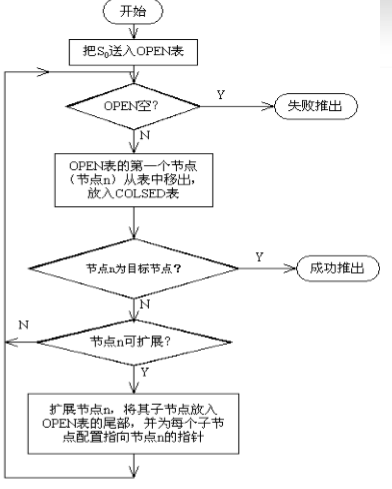

# 广度优先搜索

**基本模板代码**  
使用stl的QUEUE  
广搜代码一般由这个模板而加以改动  
> 1. 把初始节点S0放入Open表中； 
> 2. 如果Open表为空，则问题无解，失败 退出； 
> 3. 把Open表的第一个节点取出放入 Closed表，并记该节点为n；
> 4. 考察节点n是否为目标节点。若是， 则得到问题的解，成功退出；
> 5. 若节点n不可扩展，则转第(2)步； 
> 6. 扩展节点n，将其不在Closed表和 Open表中的子节点(判重）放入Open表的尾部 ，并为每一个子节点设置指向父节点的指针( 或记录节点的层次），然后转第(2)步。

如图所示：  
