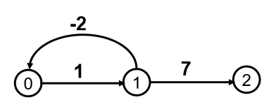

## Bellman-Ford算法

作用：
> 解决 **含负权边的带权有向图** 的单源最短路径问题
> 不能处理带负权边的无向图(因可以来回走一条负权边)  
   

限制条件:
> 要求图中不能包含权值总和为负值回路(负权值回路)，如 下图所示。   
> 
  

算法思想：
*   构造一个最短路径长度数组序列 
    dist 1 [u], dist 2 [u], …, dist n - 1 [u]  （u = 0,1…n-1,n为点数) 
    * dist 1 [u]为从源点v到终点u的只经过一条边的最短路径长度，并有 dist 1 [u] =Edge[v][u]；
    * dist 2 [u]为从源点v最多经过两条边到达终点u的最短路径长度
    * dist 3 [u]为从源点v出发最多经过不构成负权值回路的三条边到达终点u的最 短路径长度
    * …… 
    * dist n - 1 [u]为从源点v出发最多经过不构成负权值回路的n-1条边到达终点u的 最短路径长度
* 算法的最终目的是计算出 dist n - 1 [u]，为源点v到顶点u的最短路径长度。 